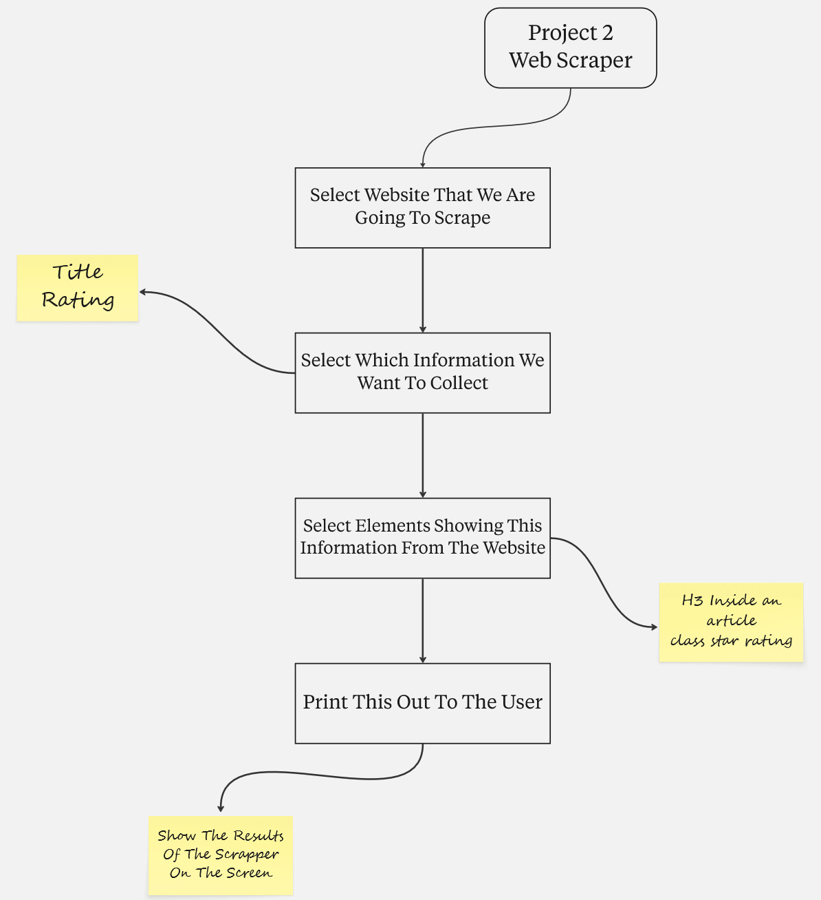
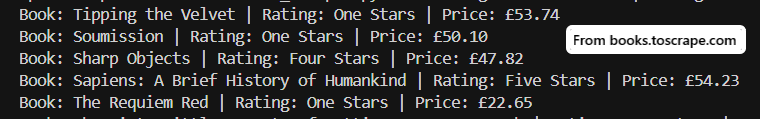
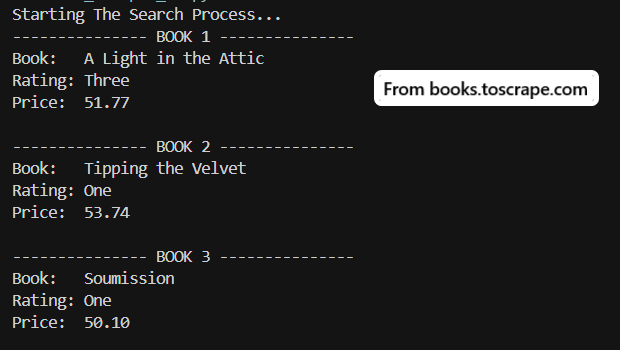
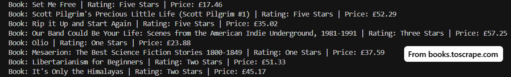
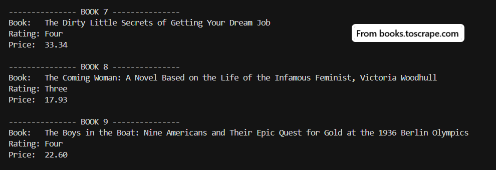
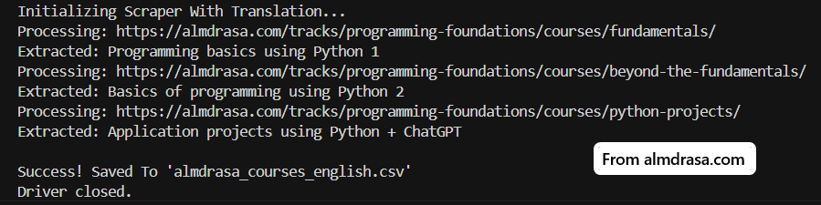
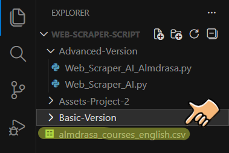
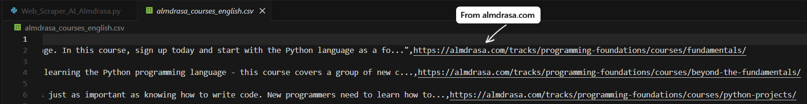
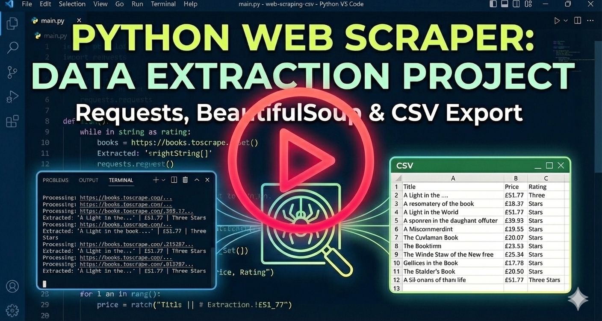

<div align="center">
  

<div align="center">
  
  <h1>Python Web Scraper Script </h1>
  
  <p>
    <i>A Comprehensive Data Extraction Tool: From Basic <strong>HTML Parsing</strong> To Advanced <strong>Browser Automation</strong>, AI Translation, And CSV Export.</i>
  </p>

  <p>
    <a href="#-about-the-project">About</a> •
    <a href="#-tech-stack--tools">Tech Stack</a> •
    <a href="#-gallery--demo">Gallery</a> •
    <a href="#-features--evolution">Evolution</a> •
    <a href="#-installation--usage">How To Run</a> •
    <a href="#-warnings--troubleshooting">Warnings</a>
  </p>
</div>

<br>

<br>

<h2 align="center" id="-about-the-project">About The Project </h2>

<div align="center">
  <p>
    <i>This Repository Represents The <strong>Second Major Milestone</strong> In My <strong>Front-End Diploma (Programming Fundamentals Track)</strong>.</i>
  </p>
  <p>
    <i>It's More Than Just A Script, It's A Documentation Of My Journey In <strong>Web Scraping & Data Mining</strong>. The Project Chronicles The Evolution From Simple Static HTML Parsing Using <strong>Requests & BeautifulSoup</strong> To A Sophisticated Browser Automation Bot Powered By <strong>Selenium WebDriver</strong>.</i>
  </p>
  <p>
    <i>The Final Version Is An Intelligent Tool That Autonomously Navigates Web Pages, Extracts Structured Metadata, <strong>Translates Arabic Content To English</strong> Using AI-Powered APIs, And Exports Clean Data In Professional <strong>CSV Format</strong> Ready For Excel And Data Analysis.</i>
  </p>
</div>

<br>

<br>

<h2 align="center" id="-tech-stack--tools">Tech Stack & Tools </h2>

<div align="center">
  
  
  
  
  
</div>

<br>

<div align="center">
  <p>
    • <strong>Python (3.13+):</strong> <i>The Core Language Driving All Scripting Logic, Data Processing, And File Management Operations.</i><br>
    • <strong>Selenium WebDriver:</strong> <i>Powers Full Browser Automation To Handle Dynamic JavaScript-Rendered Content With Headless Execution.</i><br>
    • <strong>BeautifulSoup (bs4):</strong> <i>Utilized In Early Versions For Fast And Efficient Parsing Of Static HTML DOM Structures.</i><br>
    • <strong>Deep Translator API:</strong> <i>Integrated For Automatic Translation Of Extracted Arabic Course Descriptions Into English.</i><br>
    • <strong>CSV Module:</strong> <i>Manages Structured Data Persistence, Ensuring Clean Export With UTF-8-SIG Encoding For Excel Compatibility.</i><br>
    • <strong>Miro:</strong> <i>Used For Planning And Designing The Logic Flowcharts Before Writing Any Code.</i>
  </p>
</div>

<br>

<br>

<h2 align="center" id="-gallery--demo">Gallery & Demo </h2>

<div align="center">
  <i>The Project Followed A Structured "Plan-Then-Code" Approach. Below Is The Comparison Between The Planning Phase And The Final Execution For Both Versions.</i>
</div>
<br>

<table align="center" width="100%">
  <tr>
    <th style="text-align: center;" width="50%">Basic Version</th>
    <th style="text-align: center;" width="50%">Advanced Version</th>
  </tr>
  
  <tr>
    <td align="center">
      <strong>Planning (Logic)</strong><br><br>
      
    </td>
    <td align="center">
      <strong>Planning (Logic)</strong><br><br>
      
    </td>
  </tr>

  <tr>
    <td align="center" valign="top">
      <strong>Execution (Main Result)</strong><br><br>
      
    </td>
    <td align="center" valign="top">
      <strong>Execution (Main Result)</strong><br><br>
      
    </td>
  </tr>
</table>

<br>

<div align="center">
<details>
  <summary style="font-size: 1.2em; font-weight: bold; cursor: pointer;">View More Screenshots (Click Here) </summary>
  <br>
  
  <h3>Basic Version - Extra Shots</h3>
  
  
  <br><br><hr><br>
  
  <h3>Advanced Version - Extra Shots</h3>
  <table align="center" width="100%">
    <tr>
      <td align="center" valign="middle" width="50%">
        
      </td>
      <td align="center" valign="middle" width="50%">
        
      </td>
    </tr>
  </table>
  
  <br>
  
  
  
  <br><br>
  
  
  
</details>
</div>

<br>

<div align="center">
  <h3>Live Demo </h3>
  <p><i>Watch The Script In Action: Automating The Browser & Exporting Data To CSV.</i></p>
  
  <a href="https://drive.google.com/file/d/1h2j3XYgXURayk947LfDwH2dzuQk95lSo/view?usp=drive_link" target="_blank">
    
    <br>
    <em>Click To Watch Video ▷</em>
  </a>
</div>

<br>

<br>

<h2 align="center" id="-features--evolution">Features & Evolution </h2>

<div align="center">
<i>The Transition From The Basic Script To The Advanced Automation Tool Highlights A Significant Leap In Technical Complexity And Real-World Utility.</i>
</div>
<br>

<table align="center" style="border-collapse: collapse; width: 85%;">
  <thead>
    <tr>
      <th align="center" style="border: 1px solid #ddd; padding: 12px; text-align: center;"><strong>Feature</strong></th>
      <th align="center" style="border: 1px solid #ddd; padding: 12px; text-align: center;"><strong>Basic Version</strong></th>
      <th align="center" style="border: 1px solid #ddd; padding: 12px; text-align: center;"><strong>Advanced Version (AI-Ready)</strong></th>
    </tr>
  </thead>
  <tbody>
    <tr>
      <td align="center" style="border: 1px solid #ddd; padding: 10px;"><strong>Methodology</strong></td>
      <td align="center" style="border: 1px solid #ddd; padding: 10px;">Static HTTP Requests (`Requests`)</td>
      <td align="center" style="border: 1px solid #ddd; padding: 10px;"><strong>Browser Automation</strong> (`Selenium`)</td>
    </tr>
    <tr>
      <td align="center" style="border: 1px solid #ddd; padding: 10px;"><strong>Target Content</strong></td>
      <td align="center" style="border: 1px solid #ddd; padding: 10px;">Static HTML Pages Only</td>
      <td align="center" style="border: 1px solid #ddd; padding: 10px;"><strong>Dynamic JavaScript</strong> Rendered Pages</td>
    </tr>
    <tr>
      <td align="center" style="border: 1px solid #ddd; padding: 10px;"><strong>Data Output</strong></td>
      <td align="center" style="border: 1px solid #ddd; padding: 10px;">Console Print Statements</td>
      <td align="center" style="border: 1px solid #ddd; padding: 10px;">Structured <strong>CSV File Export</strong></td>
    </tr>
    <tr>
      <td align="center" style="border: 1px solid #ddd; padding: 10px;"><strong>Processing</strong></td>
      <td align="center" style="border: 1px solid #ddd; padding: 10px;">Raw Text Extraction</td>
      <td align="center" style="border: 1px solid #ddd; padding: 10px;">Text Cleaning & <strong>AI Translation</strong></td>
    </tr>
    <tr>
      <td align="center" style="border: 1px solid #ddd; padding: 10px;"><strong>Error Handling</strong></td>
      <td align="center" style="border: 1px solid #ddd; padding: 10px;">Basic Try-Except Blocks</td>
      <td align="center" style="border: 1px solid #ddd; padding: 10px;"><strong>Safe Extract Wrapper</strong> Function</td>
    </tr>
    <tr>
      <td align="center" style="border: 1px solid #ddd; padding: 10px;"><strong>Browser Support</strong></td>
      <td align="center" style="border: 1px solid #ddd; padding: 10px;">N/A (No Browser)</td>
      <td align="center" style="border: 1px solid #ddd; padding: 10px;"><strong>Headless Mode</strong> (Any Browser)</td>
    </tr>
  </tbody>
</table>

<br>

<div align="center">
  <h3>Key Features In Advanced Version </h3>
  <p>
    • <i><strong>Flexible Browser Engine:</strong> While Originally Developed Using <strong>Zen Browser</strong>, The Script Can Be Easily Configured To Run On Any Selenium-Supported Browser (Chrome, Firefox, Edge).</i><br>
    • <i><strong>Smart Translation Wrapper:</strong> Implements A Reusable `safe_extract_and_translate()` Function That Gracefully Handles Missing Elements, Cleans Unwanted Characters, And Translates Content Automatically.</i><br>
    • <i><strong>Headless Operation:</strong> The Browser Runs Invisibly In The Background (`--headless` Flag), Making The Scraping Process Faster And More Resource-Efficient.</i><br>
    • <i><strong>Excel-Ready Output:</strong> Uses UTF-8-SIG Encoding To Ensure Perfect Display Of Unicode Characters In Microsoft Excel Without Corruption.</i>
  </p>
</div>

<br>

<br>

<h2 align="center" id="-installation--usage">Installation & Usage </h2>

<div align="center">
  <i>Follow The Steps Below To Run The Project Locally On Your Machine - Ensure You Have <strong>Python 3.10+</strong> And A Compatible Browser Installed.</i>
</div>

<br>

<div align="center">
  <h3>1️⃣ Clone The Repository</h3>
  <i>Open Your Terminal And Run The Following Command To Download The Project Files:</i>
</div>

```bash
git clone https://github.com/hexbido/Python-Web-Scraper-Script.git
cd Python-Web-Scraper-Script
```

<br>

<div align="center">
  <h3>2️⃣ Install Required Dependencies</h3>
  <i>Install All Necessary Python Packages Using Pip:</i>
</div>

```bash
# If You Are Using 'pip3' Place The Number "3" After pip.
pip install requests beautifulsoup4 selenium webdriver-manager deep-translator
```

<br>

<div align="center">
  <h3>3️⃣ Run The Basic Version</h3>
  <i>Navigate To The Basic Version Folder And Execute The Script:</i> 
</div>

```bash
cd Basic-Version
python Web_Scraper.py
```

<br>

<div align="center">
  <h3>4️⃣ Run The Intermediate Version (Enhanced)</h3>
  <i>To Try The Improved Version With Better Error Handling And Formatting:</i> 
</div>

```bash
cd Advanced-Version
python Web_Scraper_AI.py
```

<br>

<div align="center">
  <h3>5️⃣ Run The Advanced Version (Selenium + AI)</h3>
  <i>To Try The Full Browser Automation With AI Translation, Navigate To The Advanced Folder:</i> 
</div>

```bash
cd Advanced-Version
python Web_Scraper_AI_Almdrasa.py
```

<br>

<div align="center">
  <h3>6️⃣ Configure Your Browser Path (Optional)</h3>
  <i>If Using A Custom Browser Like Zen Or Any Browser, Update The Browser Path In The Configuration Section:</i>
</div>

```python
# Line 13 In Web_Scraper_AI_Almdrasa.py:
BROWSER_PATH = r"C:\Path\To\Your\Browser\browser.exe"
```

<br>

<br>

<h2 align="center" id="-warnings--troubleshooting">Warnings & Troubleshooting </h2>

<div align="center">
  <p><i>Please Review The Following Notes To Ensure Smooth Operation And Avoid Common Issues:</i></p>
  
  <p>
    • <strong>GeckoDriver Installation:</strong> <i>The Script Uses `webdriver-manager` To Automatically Download The Correct GeckoDriver. However, Ensure You Have A Stable Internet Connection During First Run.</i><br><br>
    • <strong>Browser Compatibility:</strong> <i>If You Encounter Issues With Zen Browser, Switch To Standard Firefox By Commenting Out The `binary_location` Line In The Configuration Section.</i><br><br>
    • <strong>Website Structure Changes:</strong> <i>Web Scraping Scripts Are Sensitive To HTML Structure Changes - If The Target Website Updates Its Layout, The Selectors May Need Adjustment.</i><br><br>
    • <strong>Rate Limiting:</strong> <i>Avoid Running The Script Too Frequently On The Same Website To Prevent Being Blocked - Add Delays Using `time.sleep()` Between Requests If Needed.</i><br><br>
    • <strong>CSV Encoding:</strong> <i>The Script Uses UTF-8-SIG Encoding For Excel Compatibility - If You Experience Character Display Issues, Verify Your Excel Settings Support UTF-8.</i><br><br>
    • <strong>Translation API Limits:</strong> <i>The Deep Translator Library Uses Google Translate - Excessive Requests May Trigger Temporary Rate Limits - Use Responsibly.</i>
  </p>
</div>

<br>

<div align="center">
  <p><i>Made With  By <a href="https://github.com/hexbido">B I D O</a></i></p>
</div>


